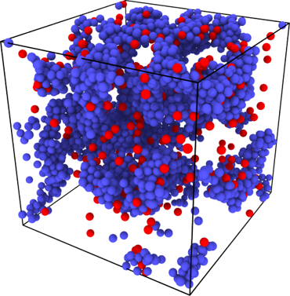

# Activerun

MD code for active particle simulation, support both 2D and 3D.

Support multithreads. Implement LJ and Morse potential. Provide pressure output and LAMMPS trajectory output.

Used in paper: Omar, A. K., Wu, Y., Wang, Z. G., & Brady, J. F. (2018). *ACS nano*, 13(1), 560-572. [link](https://dx.doi.org/10.1021/acsnano.8b07421)

